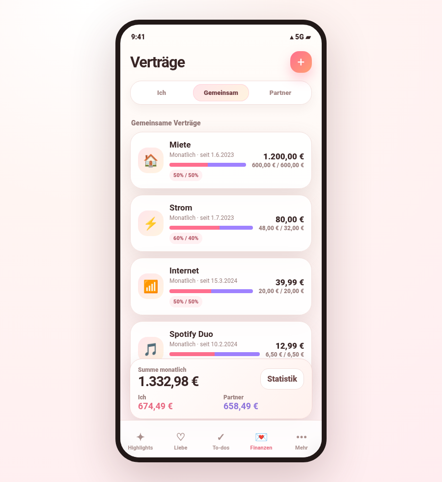
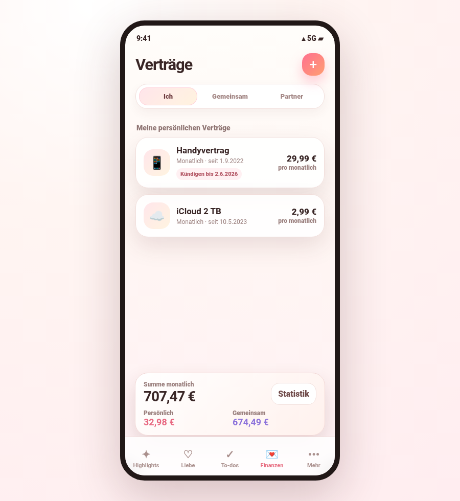
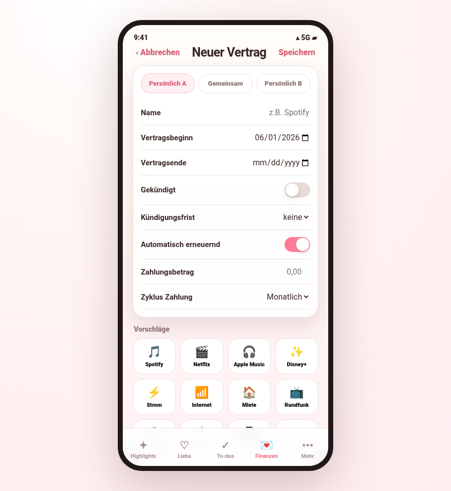
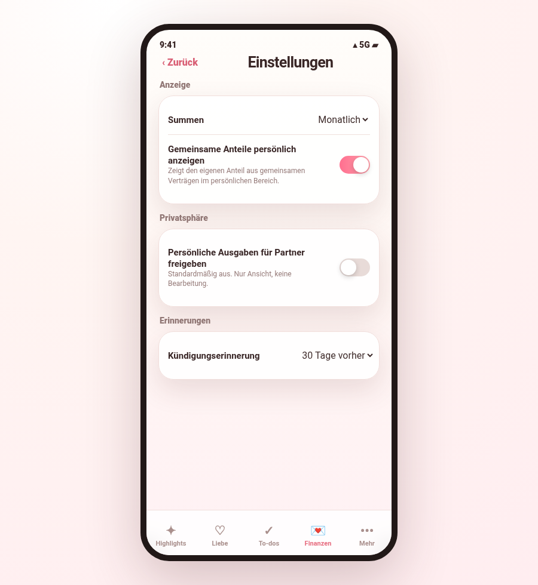

# Happy Love – Verträge & Abos

Kompaktes Feature-Konzept für die Verwaltung persönlicher und gemeinsamer Verträge in **Happy Love**.

**Mockup:** https://happy-love.davelabs.work

## Ziel

Paare sollen laufende Verträge, Abos und Fixkosten transparent verwalten können, ohne dass persönliche Ausgaben automatisch für den Partner sichtbar sind.

## Bereiche

Die Funktion besteht aus drei Tabs:

| Bereich | Inhalt | Sichtbarkeit |
|---|---|---|
| Persönlich Partner A | Private Verträge von Partner A | Standardmäßig nur Partner A |
| Gemeinsam | Gemeinsame Verträge beider Partner | Beide Partner |
| Persönlich Partner B | Private Verträge von Partner B | Standardmäßig nur Partner B |

Persönliche Verträge bleiben im jeweiligen persönlichen Bereich. Gemeinsame Verträge werden nur im gemeinsamen Bereich angelegt.

## Privatsphäre

- Persönliche Ausgaben des Partners sind standardmäßig nicht sichtbar.
- In den Einstellungen kann ein Partner seine persönlichen Ausgaben für den anderen freigeben.
- Freigabe bedeutet nur Ansicht, keine Bearbeitung.
- Gemeinsame Verträge sind für beide Partner sichtbar und verwaltbar.

## Vertrag anlegen

### Felder

| Feld | Pflicht | Beschreibung |
|---|---:|---|
| Name | Ja | Vertragsname, z. B. Spotify, Strom, Internet |
| Vertragsbeginn | Ja | Startdatum des Vertrags |
| Vertragsende | Nein | Enddatum, falls bekannt |
| Gekündigt | Nein | Markiert den Vertrag als gekündigt |
| Kündigungsfrist | Nein | Frist vor Vertragsende |
| Automatisch erneuernd | Nein | Vertrag verlängert sich automatisch |
| Zahlungsbetrag | Ja | Betrag pro Zahlungszyklus |
| Zahlungszyklus | Ja | Zahlungsintervall |

### Zahlungszyklen

- Wöchentlich
- Alle zwei Wochen
- Monatlich
- Quartal
- Halbes Jahr
- Jahr

Alle Beträge werden für Übersichten intern auf Monats- und Jahreswerte umgerechnet.

## Gemeinsame Verträge

Bei gemeinsamen Verträgen wird der Betrag standardmäßig 50/50 geteilt.

Die Aufteilung kann angepasst werden:

- 50/50 Standard
- Partner A zahlt 100 %
- Partner B zahlt 100 %
- Flexible Aufteilung per Slider
- Slider rastet bei 50/50 ein
- Reset auf 50/50 möglich

Die Summe der Anteile muss immer 100 % ergeben.

## Übersichten und Summen

Jeder Bereich zeigt eine eigene Summe der laufenden Ausgaben.

Anzeigeoption:

- Monatlich
- Jährlich

Im persönlichen Bereich kann optional zusätzlich der eigene Anteil an gemeinsamen Verträgen angezeigt werden.

## Vertragsstatus

Ein Vertrag gilt als laufend, solange er aktiv ist.

Ein gekündigter Vertrag wird nach dem Vertragsende nicht mehr in laufenden Übersichten angezeigt.

Empfohlene Logik:

```text
Wenn gekündigt = true und Vertragsende <= heute:
  Vertrag aus laufender Übersicht ausblenden

Wenn automatisch erneuernd = false und Vertragsende <= heute:
  Vertrag aus laufender Übersicht ausblenden

Wenn automatisch erneuernd = true:
  Vertrag bleibt aktiv, solange er nicht gekündigt und beendet ist
```

## Vorschläge

Die App zeigt Schnellvorschläge zum Hinzufügen typischer Verträge.

Beispiele:

- Spotify
- Apple Music
- Netflix
- Disney+
- Strom
- Internet
- Miete
- Rundfunkbeitrag
- Versicherung
- Wasser
- Handyvertrag
- iCloud

Ein Vorschlag öffnet den Erstellen-Dialog mit vorausgefülltem Namen und optionalem Betrag/Icon.

## Kündigungserinnerungen

Die App kann an Kündigungen erinnern.

Basislogik:

```text
Kündigungstermin = Vertragsende - Kündigungsfrist
Erinnerung = Kündigungstermin - Erinnerungs-Vorlauf
```

Einstellbare Erinnerung:

- Am letzten Kündigungstag
- 7 Tage vorher
- 30 Tage vorher

## Statistik

Die Statistik zeigt die Entwicklung laufender Kosten.

Mögliche Auswertungen:

- Persönliche Kosten Partner A
- Persönliche Kosten Partner B
- Gemeinsame Kosten
- Gesamtkosten über Zeit
- Veränderung gegenüber Vormonat

Wichtig: Für korrekte Statistik sollten Betragsänderungen historisiert werden, statt alte Werte zu überschreiben.

## Screenshots

### Gemeinsamer Bereich



### Persönlicher Bereich



### Neuer Vertrag



### Einstellungen



## MVP-Scope

Für die erste Version sinnvoll:

1. Drei Bereiche: Partner A, Gemeinsam, Partner B
2. Vertrag anlegen, bearbeiten, archivieren
3. Zahlungszyklen und Monats-/Jahresumrechnung
4. Gemeinsame Verträge mit 50/50-Standard und Slider-Aufteilung
5. Privatsphäre-Freigabe für persönliche Ausgaben
6. Summen je Bereich
7. Vorschläge zum schnellen Hinzufügen
8. Kündigungserinnerungen

Nicht im MVP:

- Banking-Anbindung
- Automatischer Rechnungsimport
- Vertragskündigung aus der App
- Mehr als zwei Partner
- Komplexe Haushaltsbuch-Funktionen

## Offene Entscheidungen

- Dürfen beide Partner gemeinsame Verträge bearbeiten oder nur der Ersteller?
- Werden Betragsänderungen immer historisiert?
- Soll die Freigabe persönlicher Ausgaben global oder je Vertrag gelten?
- Sollen abgelaufene Verträge archiviert oder komplett ausgeblendet werden?
